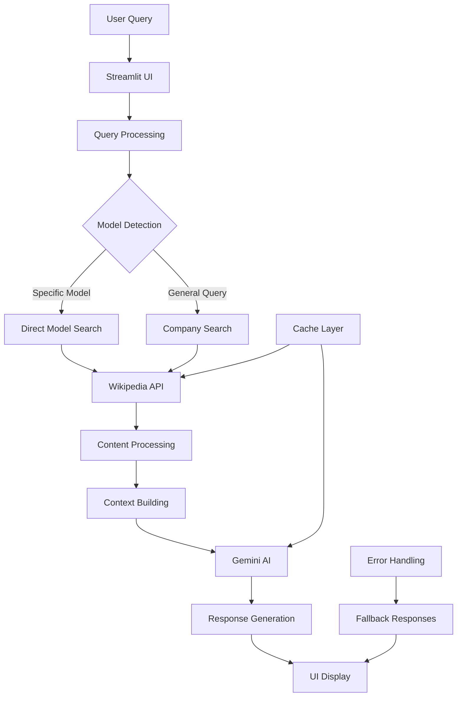

# Automotive RAG Assistant - Complete Architecture Documentation

## Table of Contents
1. [Overview](#overview)
2. [System Architecture](#system-architecture)
3. [Component Breakdown](#component-breakdown)
4. [Data Flow](#data-flow)
5. [API Integration](#api-integration)
6. [Caching Strategy](#caching-strategy)
7. [Error Handling](#error-handling)
8. [Deployment Architecture](#deployment-architecture)
9. [Security Considerations](#security-considerations)
10. [Performance Optimizations](#performance-optimizations)
11. [Future Enhancements](#future-enhancements)

## Overview

The Automotive RAG (Retrieval-Augmented Generation) Assistant is a sophisticated AI-powered application that combines Wikipedia data retrieval with Google Gemini AI to provide intelligent responses about automotive topics. The system uses a hybrid approach of real-time data fetching and AI-powered response generation.

### Key Features
- **Real-time Wikipedia Integration**: Fetches current automotive information
- **AI-Powered Responses**: Uses Google Gemini for intelligent answer generation
- **Smart Query Processing**: Handles automotive-specific queries with model detection
- **Interactive Chat Interface**: Streamlit-based conversational UI
- **Intelligent Caching**: Optimized performance with smart caching strategies

## System Architecture



### High-Level Components

1. **Frontend Layer**: Streamlit-based web interface
2. **Processing Layer**: Query normalization and model detection
3. **Data Layer**: Wikipedia API integration with smart caching
4. **AI Layer**: Google Gemini integration for response generation
5. **Caching Layer**: Multi-level caching for performance optimization

## Component Breakdown

### 1. Frontend Layer (`streamlit_app.py`)

**Purpose**: User interface and interaction management

**Key Components**:
- **Session State Management**: Tracks conversation history and model state
- **UI Components**: Chat interface, input forms, debug panels
- **Error Display**: User-friendly error messages and status indicators

**Architecture Details**:
```python
# Session State Structure
session_state = {
    'messages': [],           # Chat history
    'gemini_model': None,    # Cached AI model
    'example_query': None    # Pre-filled queries
}
```

**Key Functions**:
- `main()`: Application entry point and UI orchestration
- Session state initialization and management
- Real-time chat display with message formatting
- Debug information display for troubleshooting

### 2. Query Processing Layer (`logic/wiki_utils.py`)

**Purpose**: Intelligent query analysis and Wikipedia data retrieval

**Key Components**:

#### A. Model Detection System
```python
model_keywords = [
    'mustang', 'camaro', 'corvette', 'f-150', 'civic', 'accord',
    'corolla', 'camry', 'model s', 'model 3', 'model x', 'model y',
    '911', 'm3', 'm5', 'golf', 'beetle', 'prius', 'wrangler'
]
```

#### B. Smart Search Strategy
- **Direct Model Search**: For specific car models (e.g., "Ford Mustang")
- **Company Search**: For general manufacturer queries (e.g., "Tesla")
- **Fallback Mechanisms**: Multiple search attempts with different strategies

#### C. Content Extraction Pipeline
```python
def _extract_relevant_summary(text: str, query: str) -> str:
    # Extracts relevant sentences based on query keywords
    # Prioritizes production dates, introduction info, specifications
```

**Key Functions**:
- `retrieve_wikipedia_data()`: Main data retrieval function
- `_search_wikipedia()`: Internal search with multiple strategies
- `_extract_relevant_summary()`: Smart content extraction
- `_extract_dates_info()`: Date-specific information extraction
- `parse_infobox()`: Structured data extraction from Wikipedia markup

### 3. AI Integration Layer (`logic/gemini_utils.py`)

**Purpose**: Google Gemini AI integration and response generation

**Key Components**:

#### A. Model Initialization
```python
@streamlit_cache_resource
def setup_gemini():
    # Cached model initialization with API key validation
    # Includes model testing and error handling
```

#### B. Context Building
```python
def _build_context_string(context: dict) -> str:
    # Prioritizes important fields (Founded, Established, etc.)
    # Extracts founding information from summary if not in infobox
    # Builds comprehensive context for AI
```

#### C. Response Generation
```python
def generate_gemini_response(model, query: str, context: dict):
    # Validates model and context availability
    # Generates AI responses with comprehensive error handling
    # Returns formatted responses with context information
```

**Key Functions**:
- `setup_gemini()`: Model initialization with caching
- `generate_gemini_response()`: AI response generation
- `_build_context_string()`: Context formatting for AI
- `_extract_founding_info()`: Additional data extraction
- `_build_prompt()`: AI prompt construction

### 4. Caching Strategy

**Multi-Level Caching System**:

#### A. Streamlit Caching
```python
@streamlit_cache_data(ttl=3600, show_spinner=False, max_entries=100)
def retrieve_wikipedia_data(query: str):
    # Wikipedia data caching (1 hour TTL)
```

```python
@streamlit_cache_resource(max_entries=1)
def setup_gemini():
    # AI model caching (persistent across sessions)
```

#### B. Fallback Mechanisms
- **Streamlit Context Detection**: Automatically detects if running in Streamlit
- **Non-Streamlit Fallback**: Functions work outside Streamlit environment
- **Error Recovery**: Graceful degradation when caching fails

### 5. Error Handling System

**Comprehensive Error Management**:

#### A. API Error Handling
```python
try:
    response = requests.get(API_URL, params=search_params, timeout=15)
    response.raise_for_status()
except requests.RequestException as e:
    print(f"Wikipedia API error: {e}")
    return None
```

#### B. AI Error Handling
```python
try:
    response = model.generate_content(prompt)
    if not response or not response.text:
        return "No response generated. Please try again.", None
except Exception as e:
    return f"Error generating response: {e}", None
```

#### C. User-Friendly Error Messages
- **API Failures**: Clear messages about Wikipedia connectivity
- **AI Failures**: Helpful guidance for API key configuration
- **Data Failures**: Suggestions for query reformulation

## Data Flow

### 1. Query Processing Flow

```
User Input → Query Normalization → Model Detection → Search Strategy Selection
```

### 2. Data Retrieval Flow

```
Wikipedia API → Content Extraction → Summary Generation → Infobox Parsing → Context Building
```

### 3. AI Response Flow

```
Context + Query → Prompt Building → Gemini AI → Response Generation → UI Display
```

### 4. Caching Flow

```
Request → Cache Check → Cache Miss → API Call → Cache Store → Response
```

## API Integration

### 1. Wikipedia API Integration

**Endpoint**: `https://en.wikipedia.org/w/api.php`

**Key Parameters**:
```python
search_params = {
    "action": "query",
    "format": "json", 
    "list": "search",
    "srsearch": query,
    "utf8": 1,
    "srlimit": 5
}
```

**Content Retrieval**:
```python
content_params = {
    "action": "parse",
    "page": page_title,
    "format": "json",
    "prop": "text|wikitext",
    "redirects": 1
}
```

### 2. Google Gemini API Integration

**Model**: `models/gemini-flash-latest`

**Authentication**: Environment variable `GEMINI_API_KEY`

**Request Structure**:
```python
prompt = f"""You are an expert automotive assistant. Use the provided context to answer the user's question.

CONTEXT:
{context_str}

USER'S QUESTION: {query}

Please provide a helpful answer based on the context above.
ANSWER:"""
```

## Caching Strategy

### 1. Wikipedia Data Caching
- **TTL**: 1 hour (3600 seconds)
- **Max Entries**: 100 queries
- **Strategy**: Query-based caching with content validation

### 2. AI Model Caching
- **Type**: Resource caching (persistent)
- **Max Entries**: 1 (single model instance)
- **Strategy**: Model initialization caching

### 3. Fallback Caching
- **Streamlit Detection**: Automatic context detection
- **Non-Streamlit Support**: Functions work outside Streamlit
- **Error Recovery**: Graceful degradation

## Error Handling

### 1. Network Errors
- **Wikipedia API**: Timeout handling, retry mechanisms
- **Gemini API**: Connection error handling, API key validation

### 2. Data Errors
- **Empty Responses**: Content validation and fallback messages
- **Malformed Data**: Parsing error handling and recovery

### 3. User Experience Errors
- **Clear Error Messages**: User-friendly error descriptions
- **Debug Information**: Technical details for troubleshooting
- **Recovery Suggestions**: Actionable guidance for users

## Deployment Architecture

### 1. Local Development
```bash
streamlit run streamlit_app.py
```

### 2. Streamlit Cloud Deployment
- **Repository**: GitHub integration
- **Environment Variables**: `GEMINI_API_KEY` configuration
- **Automatic Deployment**: Git-based deployment

### 3. Docker Deployment
```dockerfile
FROM python:3.9-slim
WORKDIR /app
COPY requirements.txt .
RUN pip install -r requirements.txt
COPY . .
EXPOSE 8501
CMD ["streamlit", "run", "streamlit_app.py"]
```

## Security Considerations

### 1. API Key Management
- **Environment Variables**: Secure API key storage
- **No Hardcoding**: Keys never committed to repository
- **Example Configuration**: `.env.example` for setup guidance

### 2. Data Privacy
- **No Data Storage**: No persistent user data storage
- **Session-Based**: Temporary session state only
- **External APIs**: Data processed through official APIs

### 3. Input Validation
- **Query Sanitization**: Input cleaning and validation
- **Error Boundaries**: Comprehensive error handling
- **Rate Limiting**: Built-in API rate limiting

## Performance Optimizations

### 1. Caching Optimizations
- **Multi-Level Caching**: Wikipedia and AI model caching
- **Smart TTL**: Appropriate cache expiration times
- **Cache Invalidation**: Automatic cache management

### 2. API Optimizations
- **Request Batching**: Efficient API usage
- **Timeout Management**: Appropriate timeout settings
- **Retry Logic**: Smart retry mechanisms

### 3. UI Optimizations
- **Lazy Loading**: On-demand content loading
- **Session Management**: Efficient state management
- **Responsive Design**: Mobile-optimized interface

## Future Enhancements

### 1. Advanced Features
- **Multi-Language Support**: International Wikipedia integration
- **Image Processing**: Car image analysis capabilities
- **Voice Interface**: Speech-to-text integration

### 2. Performance Improvements
- **Database Integration**: Persistent caching layer
- **CDN Integration**: Content delivery optimization
- **Load Balancing**: Multi-instance deployment

### 3. AI Enhancements
- **Model Fine-tuning**: Custom automotive model training
- **Response Caching**: AI response caching
- **Context Memory**: Conversation context retention

## Technical Specifications

### 1. Dependencies
```
streamlit>=1.28.0
google-generativeai>=0.3.0
requests>=2.31.0
python-dotenv>=1.0.0
```

### 2. System Requirements
- **Python**: 3.9+
- **Memory**: 512MB minimum
- **Storage**: 100MB for dependencies
- **Network**: Internet connectivity for APIs

### 3. Browser Compatibility
- **Modern Browsers**: Chrome, Firefox, Safari, Edge
- **Mobile Support**: Responsive design
- **JavaScript**: Minimal JavaScript requirements

## Monitoring and Debugging

### 1. Debug Information
- **Session State**: Real-time state monitoring
- **API Status**: Connection and response monitoring
- **Cache Status**: Cache hit/miss tracking

### 2. Error Logging
- **Console Logging**: Development error tracking
- **User Feedback**: Error message display
- **Performance Metrics**: Response time monitoring

### 3. Health Checks
- **API Connectivity**: Wikipedia and Gemini API status
- **Model Status**: AI model availability
- **Cache Health**: Cache system status

This architecture provides a robust, scalable, and maintainable foundation for the Automotive RAG Assistant, ensuring optimal performance and user experience while maintaining security and reliability standards.
